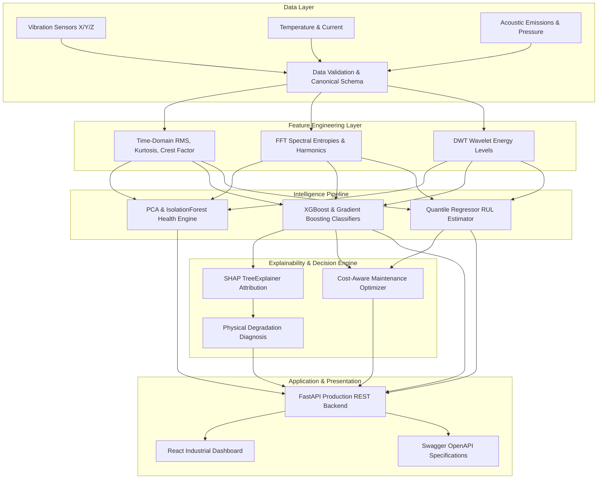

# System Architecture — Predictive Maintenance AI Platform

## Executive Summary

The Predictive Maintenance AI Platform is an end-to-end industrial machine health monitoring, failure risk prediction, remaining useful life (RUL) estimation, SHAP root-cause attribution, and maintenance cost optimization engine.

It bridges raw high-frequency sensor telemetry (vibration, temperature, acoustic emissions, current, pressure, RPM) with real-time operational decision support.

---

## 1. High-Level System Flow

---

## 2. Component Breakdown

### 2.1 Data Validation & Signal Processing (`src/signal_processing/`)
- **Time Domain**: Calculates RMS, Kurtosis, Crest Factor, Skewness, Peak-to-Peak, Variance.
- **Frequency Domain**: Computes FFT magnitude spectrum, dominant frequency, spectral entropy, BPFO/BPFI bearing energy bands, and 1X/2X shaft harmonics.
- **Wavelet Domain**: Applies 5-level Daubechies (db4) Discrete Wavelet Transform (DWT) to isolate high-frequency transient impact spikes.

### 2.2 Health Index Engine (`src/health_index/`)
- Combines Spe-based Principal Component Analysis (PCA) and Isolation Forest anomaly scores into a normalized `[0, 100]` Machine Health Index:
  $$\text{HI}(x) = 100 \times \left(1 - \text{clip}\left(\frac{\text{SPE}(x)}{\text{SPE}_{\max}}, 0, 1\right)\right)$$
- Categorized into 4 operational tiers:
  - **81 – 100**: Healthy
  - **61 – 80**: Warning (Early degradation)
  - **31 – 60**: At Risk (Schedule maintenance)
  - **0 – 30**: Critical (Imminent failure)

### 2.3 Failure Risk Prediction (`src/failure_prediction/`)
- Evaluates 72-hour failure risk using calibrated ML classification algorithms:
  - **XGBoost Classifier** (Primary active model)
  - **Gradient Boosting Classifier**
  - **Random Forest Classifier**
  - **Logistic Regression Classifier** (Linear baseline)

### 2.4 Quantile RUL Estimation (`src/rul_prediction/`)
- Predicts remaining operational life with uncertainty bounds:
  - $p_{10}$: Conservative lower bound (10th percentile)
  - $p_{50}$: Median expected RUL (50th percentile)
  - $p_{90}$: Optimistic upper bound (90th percentile)

### 2.5 Explainable AI (XAI) (`src/explainability/`)
- Evaluates local SHAP (SHapley Additive exPlanations) values to identify exact risk-contributing sensor features.
- Translates SHAP feature rankings into physical degradation diagnoses (e.g., *Bearing race spalling*, *Thermal winding overload*, *Hydraulic pressure leak*).

### 2.6 Cost Optimizer (`src/optimization/`)
- Minimizes expected cost function $E[C(t)]$ balancing unplanned failure cost ($C_{\text{cm}} + C_{\text{downtime}}$) against planned preventive intervention ($C_{\text{pm}}$):
  $$E[C(t)] = P_f(t) \cdot C_{\text{unplanned}} + (1 - P_f(t)) \cdot C_{\text{planned}}$$

---

## 3. Deployment Architecture

- **FastAPI Container**: Asynchronous Python API server running with Uvicorn.
- **Docker Compose**: Orchestrates API container, health check probes, logs, and volume mappings.
- **GitHub Actions CI**: Automated linting, benchmarking, and pytest validation.
